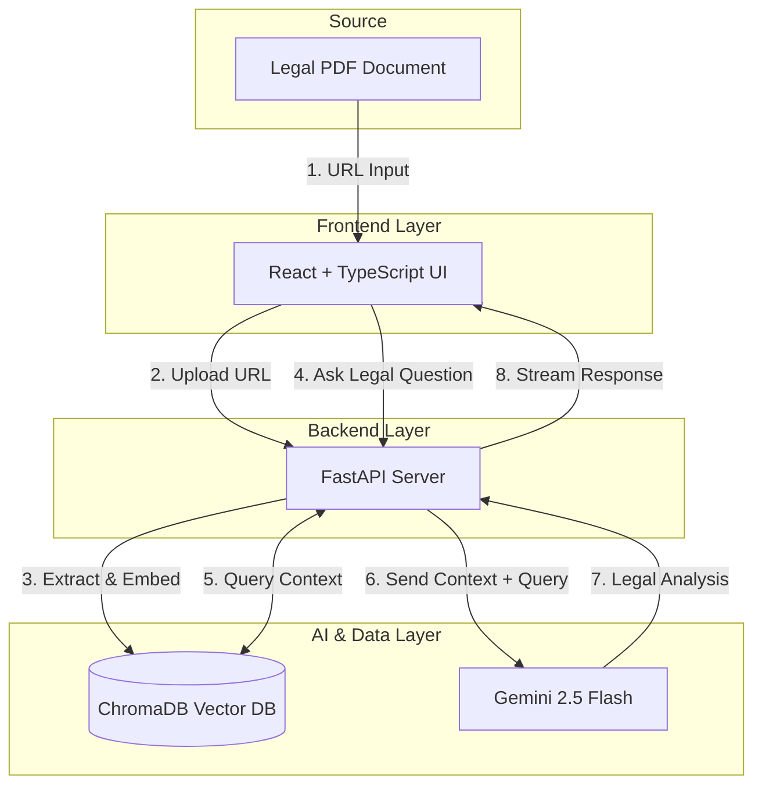

# Legal Document Agent ⚖️

An advanced AI-powered legal analysis tool that uses Retrieval-Augmented Generation (RAG) to analyze legal PDFs. Built with **FastAPI**, **React**, **ChromaDB**, and **Gemini 2.5 Flash**.

## Architecture



The project follows a modern RAG architecture:
1.  **Frontend (React + TypeScript)**: User interface for uploading PDF URLs and chatting with the agent. Supports real-time streaming responses.
2.  **Backend (FastAPI)**: REST API handling document processing (`/create-knowledge-base`) and streaming chat (`/run-agent`).
3.  **Vector DB (ChromaDB)**: Stores document embeddings generated by `models/gemini-embedding-001`.
4.  **AI Engine (Gemini 2.5 Flash)**: Generates context-aware legal answers with strict formatting and citations.

---

## Prerequisites

- **Python 3.10+**
- **Node.js 18+**
- **Google Gemini API Key** (Get one free at [aistudio.google.com](https://aistudio.google.com/))

---

## Installation & Setup

```bash
git clone https://github.com/sefatuter/Legal-Document-Agent.git
```

### 1. Backend Setup

Navigate to the backend directory:
```bash
cd Legal-Document-Agent/backend
```

Create and activate a virtual environment:
```bash
# Linux/macOS
python3 -m venv .venv
source .venv/bin/activate

# Windows
python -m venv .venv
.venv\Scripts\activate
```

Install dependencies:
```bash
pip install -r requirements.txt
```

**Configuration (.env):**
Create a `.env` file in the `backend/` directory:
```env
GEMINI_API_KEY=your_api_key_here
```

### 2. Frontend Setup

Navigate to the frontend directory:
```bash
cd frontend
```

Install Node.js dependencies:
```bash
npm install
```

---

## Usage

### Start the Backend Server
From the `backend/` directory (ensure venv is active):
```bash
uvicorn app.main:app --reload --port 8000
```
> The API will be available at `http://localhost:8000`. API Docs at `http://localhost:8000/docs`.

### Start the Frontend Application
From the `frontend/` directory:
```bash
npm run dev
```
> The application will start at `http://localhost:5173`.

---

## How to Use

1.  Open the web app at `http://localhost:5173`.
2.  **Paste a PDF URL** (e.g., a publicly accessible legal document).
3.  Click **"Start Analysis"**. The backend will download, chunk, and embed the document.
4.  Once ready, ask a specific legal question (e.g., *"What are the penalties for non-compliance?"*).
5.  Watch the answer stream in real-time, complete with citations!

---

## Key Technologies

-   **LangChain**: For advanced text splitting (`RecursiveCharacterTextSplitter`).
-   **ChromaDB**: Local vector database for semantic search.
-   **Google Gemini**:
    -   Embedding: `models/gemini-embedding-001`
    -   Generation: `models/gemini-2.5-flash`
-   **React Markdown**: For rendering rich text answers.

---

## ⚠️ Troubleshooting

-   **429 Resource Exhausted**: If you see this error during upload, the embedding API rate limit was hit. The backend has built-in backoff logic, but you can also try uploading smaller documents or waiting a minute.
-   **CORS Error**: Ensure both backend (port 8000) and frontend (port 5173) are running.

## Contribution

If you want to contribute to the project:
- Fork the repository.
- Create a branch for new features or fixes.
- Share your changes with a pull request.

Please feel free to open an “issue” with your ideas and feedback!

## License

This project is licensed with [MIT License](LICENSE). You can review the license file for details.

## Contact

For questions or support requests: [1sefatuter@gmail.com](mailto:1sefatuter@gmail.com)  

---

## Legal Disclaimer

**IMPORTANT: The information provided by this AI agent is for informational purposes only and DOES NOT constitute legal advice.**

*   The responses generated by this tool are automatic and may contain errors, inaccuracies, or outdated information.
*   No attorney-client relationship is formed by using this software.
*   **The answers provided are NOT legally binding.**
*   Always consult with a qualified attorney for professional legal advice and representation.
*   The developers of this software accept no liability for any actions taken or not taken based on the information provided by this tool.